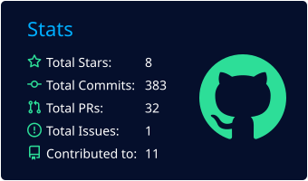
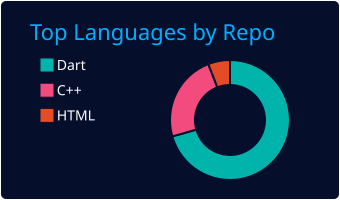
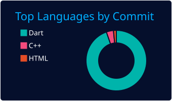
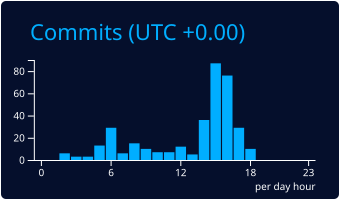
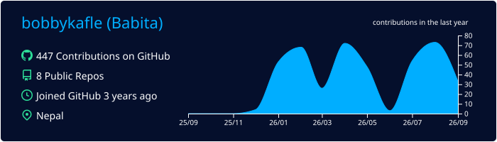

<h4> Welcome to My Digital Workspace</h4>

<h2 align="center">Babita Kaphle</h2>
<h3 align="center">Flutter Developer • Mobile App Developer</h3>
<h4 align="center">Crafting Modern Mobile Experiences with Flutter</h4>

  

  
  
  

Driven by curiosity and continuous learning, I enjoy transforming complex ideas into intuitive digital experiences. 
My focus is on writing clean, maintainable code, collaborating effectively, and building software that creates real-world impact.

---

<h3 align="center"> Technologies I Work With</h3>

<h3 align="center"> State Management & Architecture</h3>

  
  
  
  
  

---

## 👨‍💻 About Me
- 🎯 Flutter Developer building apps that are clean, scalable, and enjoyable to use
- 🔥 Completed a Flutter Internship at NDH Tech
- 📱 Experienced with Flutter, Firebase, REST APIs, SQLite & Hive
- 🧠 Currently deepening my skills in Bloc, Clean Architecture & performance optimization
- 🎓 BSc CSIT Graduate, based in Nepal 🇳🇵
- 🌍 Open to Flutter Developer opportunities and open-source collaboration
- 💬 Ask me about Flutter, Firebase & REST APIs

> "Great software isn't just code that works — it's code that's readable, maintainable, and built to solve real problems."

---

## 🚀 Featured Projects

| Project | Tech | What I Built | |
|---|---|---|---|
| 🛒 E-Commerce App | Flutter • Bloc • Firebase | Scalable shopping experience with authentication, product management, and cart |  |
| 🏋️ Fitness Tracker | Flutter • GetX • Firebase |Workout logging, body-part selection, progress tracking, and Firebase authentication. |  |
| 📋 Todo App | Flutter • Provider • Firestore | CRUD task management with authentication |  |
| 🔐 Auth Flow | Flutter • Firebase | Multi-provider authentication flow | |
| 🛎️ Service Provider App | Flutter • Clean Architecture | Service booking application |  |

---

## 📈 GitHub Analytics

  

  
  

  
  

  

---

<h3 align="center">Thanks for Visiting! 💙</h3>

⭐ If you enjoy my work, consider following my journey. 
🤝 Always open to collaboration, learning, and exciting opportunities.

